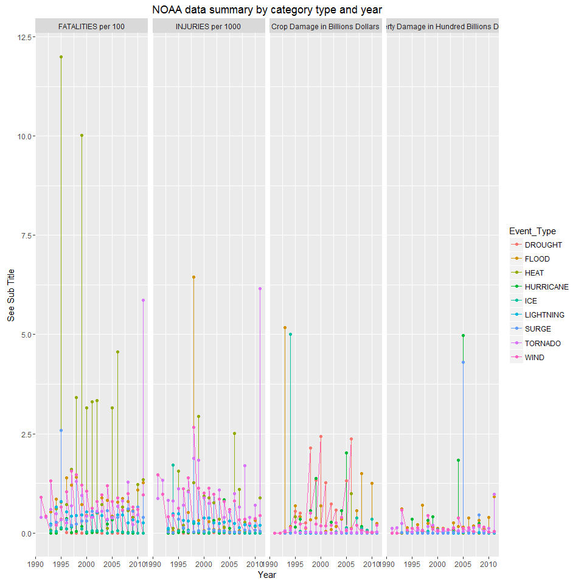
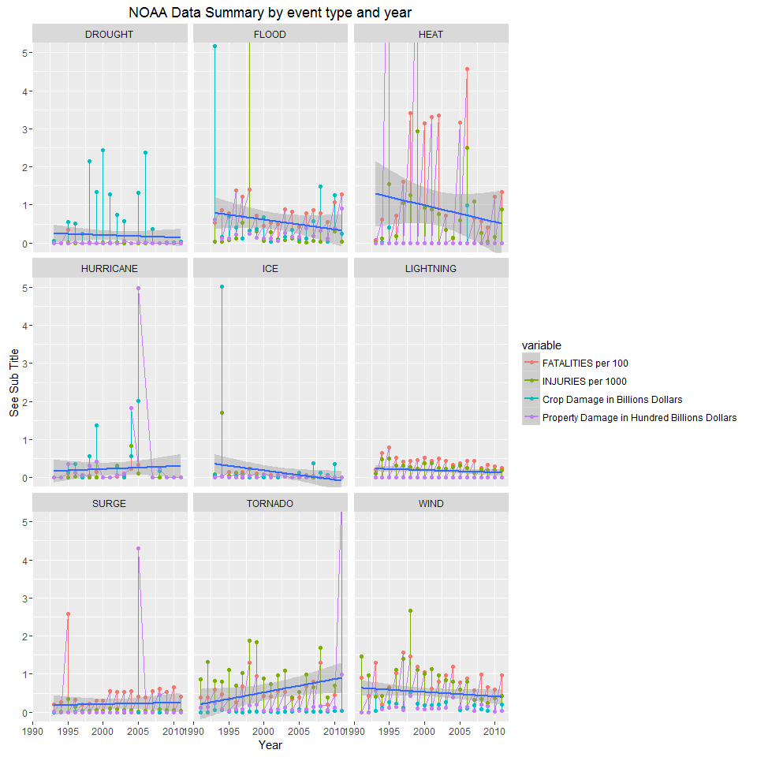
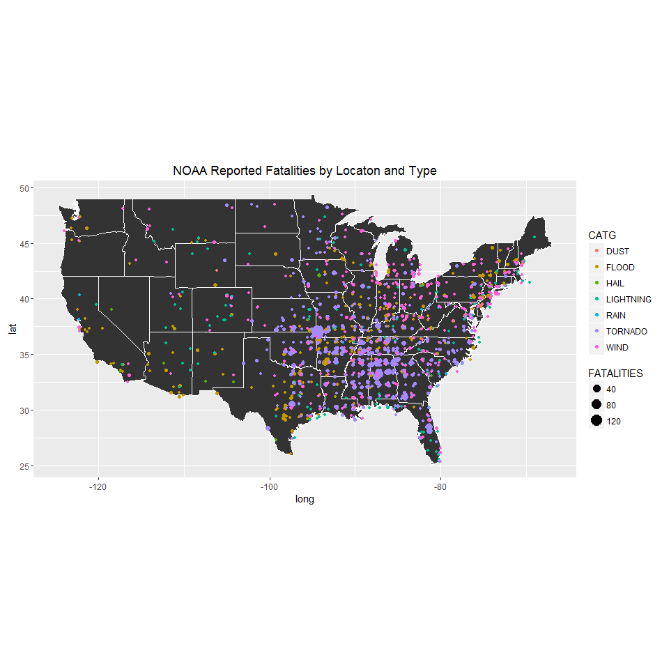

# NOAA Weather Analysis
Mark Davey  
July 24, 2016  


##Synopsis
Large rare individual events (such as Hurricane Katrina, the F5 Tornado spike in 2011 or the Chicago heat wave of 1995) outweigh usual events dominate this data. The weather is unpredictable, the fatalities, injuries and property damage are not evenly spread across time or location but tied to extreme events.

Surprisingly excessive heat is the leading cause of death by a wide margin and occurred over multiple years. This is a preventable cause of death given the availability of Air Conditioning but it is also has the greatest trend downward during data provided, which indicates government intervention was effective. 
Injuries are tied to tornadoes, flood and Wind (wind constant cause).

Property damage was dominated by Hurricane Katrina. Crop damage was not related to a single event (except for an ice storm in 1992) but droughts and floods.


##Data Processing
Check if the raw data file (i.e. the original .csv.bz2 file) exists if not download it.
Read in the compressed file directly but remove unneeded columns.
Make sure to use data.table since this is a large data set.

```r
#clean up
#setwd("C:/Users/mdavey/Google Drive/Data Science/reproducable research/Week 4")
rm(list=ls())
#list.files(path="./data")
#
#
library(lubridate)
library(data.table)
library(ggmap)
library(maps)
library(mapdata)
library(dplyr)
library(sqldf)
library(ggplot2)
library(reshape2)


###Download the data and read it into the R system
#Check if the files exist and download it (if not, unpack), then read it in to memory


#get the data from the remote system and unpack it only if does not exist
if (!file.exists("data")) {
  dir.create("data")
}
if (!file.exists("./data/StormData.csv.bz2")) {
  fileURL <- "https://d396qusza40orc.cloudfront.net/repdata%2Fdata%2FStormData.csv.bz2"
  download.file(fileURL,destfile = "./data/StormData.csv.bz2",method="libcurl")
}
#read the storm data into memory since this is large amount of data I'm using data.table rather than data.frame
#StormDataAll <- data.table(read.csv("./data/StormData.csv.bz2"))
requiredFields <- c("BGN_DATE","EVTYPE","FATALITIES","INJURIES","PROPDMG","PROPDMGEXP","CROPDMG","CROPDMGEXP","LATITUDE","LONGITUDE","REFNUM")
StormData <- data.table(subset(read.csv("./data/StormData.csv.bz2"),select=requiredFields))
```


##Data Transformation
Does the analysis include description and justification for any data transformations?

 * Fix error in data for Napa valley. Remarks and internet search show data in million not billion. I'm not going to fix all data but this was throwing off my analysis.
 * Rename events that could tag multiple items such as "HURRICANE/TYPHOON" "STORM SURGE".
 * Since property damage and crop damage have different magnitudes based upon the DMGEXP. Create a look up table with a magnitude in integer and then calculate the real value so we can sort and compare lines.
 * There is a serious problem with inconsistent event type names in this data. There are 985 unique descriptions of EVTYPE which makes analysis impossible. Create a tag dictionary so we can map keywords to 25 of the most common types. This will create a one to many relationship with certain events since for example Katrina Hurricane has "STORM SURGE" is two different tags but maps to two different categories STORM and SURGE. I can longer compare data globally except by event type.  
 * Added year from the beginning date. The documentation identifies that multiple data sources were used to create this data set. But they all had a different beginning date for instance Tornado data starts in the 1950's while Flood data does not start until the 1993. Therefore the analysis will be needing a date to start from since including Tornado data from pre 1990 will schew the results. Therefore all data in this document will be post 1990. 
 * The latitude and longitude was specified as a five or six digit number. The correct format should be a real two or three digit number  so this had to be fixed.


```r
#Serious data error Napa Valley was missed labeled in billion should be millions
StormData[StormData$REFNUM=="605943",PROPDMGEXP:="M"]
#Storm Surge
StormData[StormData$EVTYPE=="STORM SURGE",EVTYPE:="SURGE"]
#Eliminate double counting of HURRICANE & TYPHOON
StormData[StormData$EVTYPE=="HURRICANE/TYPHOON",EVTYPE:="HURRICANE"]
StormData[StormData$EVTYPE=="TROPICAL DEPRESSION",EVTYPE:="HURRICANE"]
exps <- unique(toupper(c(unique(as.character(StormData$PROPDMGEXP)),unique(as.character(StormData$CROPDMGEXP)))))
#StormDataAll[StormDataAll$CROPDMGEXP %in% c("+","?","H","-"),] #used this and found this to outlyers treated as expontial 1
#create dictionary mapping power of 10 exponetal 
expDictionary <- data.table(exp=c("K","","M","+","0","5","4","7","?","B","1","2","8","H","-","3","6"),
                            exp10=c(3,1,6,1,0,5,4,7,1,9,1,2,8,1,1,3,6))
setkey(expDictionary,exp)
setkey(StormData,CROPDMGEXP)
StormData <- StormData[expDictionary, nomatch=0,, allow.cartesian=TRUE]
setnames(StormData,"exp10","CROPDMGEXP1")
setkey(StormData,PROPDMGEXP)
StormData <- StormData[expDictionary, nomatch=0,, allow.cartesian=TRUE]
setnames(StormData,"exp10","PROPDMGEXP1")
StormData[,cropdamage := CROPDMG * (10 ** CROPDMGEXP1)]
StormData[,propdamage := PROPDMG * (10 ** PROPDMGEXP1)]

StormData[, c("date","time","fluff") := tstrsplit(as.character.POSIXt(BGN_DATE)," ", fixed=TRUE)]
StormData[, c("month","day","year") := tstrsplit(as.character.POSIXt(date),"/", fixed=TRUE)]
StormData[,year := as.numeric(year)]
StormSummaryYear <- sqldf("select year,sum(FATALITIES) as FATALITIES,sum(INJURIES) as INJURIES,sum(cropdamage) as cropdamage, sum(propdamage) as propdamage from StormData where year > 1990 group by year order by year")
StormSummaryYear
```

```
##    year FATALITIES INJURIES cropdamage  propdamage
## 1  1991         73     1355          0  1152296430
## 2  1992         54     1754          0  1406688900
## 3  1993        298     2149 5603603650 16382975793
## 4  1994        344     4161 5806664440  3776935455
## 5  1995       1491     4444 2930759460 10659909055
## 6  1996        542     2717 1888530840  6086815350
## 7  1997        601     3800 1228079400  9558060240
## 8  1998        687    11177 4507685350 11603795630
## 9  1999        908     5148 3532284100  8721226550
## 10 2000        477     2803 3329170600  5621428050
## 11 2001        469     2721 1816728100 10027043670
## 12 2002        498     3155 1410368140  4100882450
## 13 2003        443     2931 1143070350 10254548240
## 14 2004        370     2426 1452177850 25346598870
## 15 2005        469     1834 4035202300 96789791170
## 16 2006        599     3368 3534238700  7052434190
## 17 2007        421     2191 1691152000  5788934160
## 18 2008        488     2703 2209793000 15568383080
## 19 2009        333     1354  522220000  5227204130
## 20 2010        425     1855 1785286000  9246487640
## 21 2011       1002     7792  666742000 20888981960
```

```r
#OK Event types are a mess there are nearly 900 unique types
length(unique(StormData$EVTYPE))
```

```
## [1] 983
```

```r
#EventLets create tags for the event types so 
StormData$EVTYPE <- toupper(StormData$EVTYPE)
EventTypes <- data.table(EVTYPE=unique(StormData$EVTYPE))
#Create a tag dictionary to apply to event type so we can simplify this down to.
keyCategorises <- data.table(
  CATGKEY=c("TSTM WIND","EXCESSIVE HEAT","FOG","FLOOD","FLOOOD","WIND","WND","SNOW","BLIZZARD","HOT","HEAT","RECORD HIGH","TORNADO","TORNDAO",
            "HURRICANE","TYPHOON","RAIN","STORMXXX","HAIL","LIGHT","CLOUD","FUNNEL","COLD","FREEZ","COOL","LOW TEMP",
            "TIDE","DRY","PRECIPITATION","WARM","WET","ICE","FROST","VOLCANIC","SURF","SURGE","SEA","SWELLS","WAVE",
            "TSUNAMI","SUMMARY","FIRE","SMOKE","ACCIDENT","LANDSLIDE","HYPERTHERMIA","DOWNBURST","RIP CURRENT",
            "GUSTNADO","SLIDE","HIGH TEMPERATURE RECORD","HEAVY SHOWERS","SEVERE TURBULENCE","WATERSPOUT","EROSION",
            "REMNANTS OF FLOYD","DROUGHT","LANDSPOUT","DRIEST","TROPICAL DEPRESSION","RECORD TEMPERATURES","HIGH WATER",
            "RECORD LOW" ,"AVALANCHE","MARINE MISHAP","APACHE COUNTY","HEAVY MIX","DAM FAILURE","SOUTHEAST","BEACH EROSIN","HYPOTHERMIA",
            "SLEET","DUST","HEAVY PRECIPATATION","URBAN/SMALL","HIGHXXX","WATER SPOUT","MICROBURST","URBAN AND SMALLXXX","GLAZE",
            "WINTRY MIX","WINTER WEATHER","WAYTERSPOUT","LIGNTNING" ,"SMALL STREAM AND XXX",     
            "AVALANCE","OTHERX","ICY ROADS","RAPIDLY RISING WATER","TSTMW" ,               
            "?","WINTER MIX","MILD PATTERN","HEAVY SHOWER",         
            "URBAN SMALL","SMALL STREAM","URBAN/SML STREAM FLD","TEMPERATURE RECORD","LANDSLUMP",            
            "RECORD TEMPERATURE","MIXED PRECIP","NO SEVERE WEATHER","SML STREAM FLD","NONE",          
            "DAM BREAK","URBAN/SML STREAM FLDG","WINTERY MIX","SEICHE","TSTM",                
            "VOG","MONTHLY TEMPERATURE","WINTER WEATHER MIX","RED FLAG CRITERIA","WINTER WEATHER/MIX" ,"DROWNING" ),
  CATG=c("WIND","HEAT","FOG","FLOOD","FLOOD","WIND","WIND","SNOW","SNOW","HEAT","HEAT","HEAT","TORNADO","TORNADO","HURRICANE",
         "HURRICANE","RAIN","STORM","HAIL","LIGHTNING","CLOUD","CLOUD","COLD","COLD","COLD","COLD","TIDE","DROUGHT",
         "RAIN","HEAT","RAIN","ICE","ICE","VOLCANIC","SURGE","SURGE","SURGE","SURGE","SURGE","TSUNAMI","MISC","FIRE",
         "FIRE","ACCIDENT","LANDSLIDE","COLD","RAIN","SURGE" ,"TORNADO","LANDSLIDE","HEAT","RAIN","WIND","TORNADO",
         "LANDSLIDE","HURRICANE","DROUGHT","TORNADO","DROUGHT","HURRICANE","HEAT","FLOOD","COLD","AVALANCHE","ACCIDENT","MISC",
         "RAIN","ACCIDENT","MISC","MISC","COLD","SNOW","DUST","RAIN","MISC","MISC","MISC","RAIN","MISC","ICE",
         "SNOW","SNOW","TORNADO","LIGHTNING" ,"MISC",     
         "AVALANCHE","MISC","ICE","FLOOD","MISC","MISC","SNOW","MISC","RAIN",         
         "MISC","MISC","FLOOD","HEAT","LANDSLIDE","HEAT","RAIN","MISC","FLOOD","MISC",          
         "ACCIDENT","FLOOD","SNOW","SURGE","WIND","FOG","MISC","SNOW","MISC","SNOW" ,"ACCIDENT" ))
#How many unique tags for EventTypes
length(unique(keyCategorises$CATG))
```

```
## [1] 25
```

```r
#confirm no untagged eventtypes
EventTypesRemain <- data.frame(EVTTYPE=EventTypes[!grepl(paste(keyCategorises$CATGKEY,collapse="|"),EventTypes$EVTTYPE),] )
#Use a little bit of sql to create a look up table of eventtypes to tags Note this is a 1->M relationship
#since some event types such as "HOT and DROUGHT" map to two tags "HOT","DROUGHT" but this is needed since the evaluation by tag
GeneralEventTypes <- 
  data.table(sqldf("select distinct et.EVTYPE,kc.CATG,kc.CATGKEY from EventTypes et inner join keyCategorises kc on instr(et.EVTYPE,kc.CATGKEY) > 0"))
setkey(GeneralEventTypes,EVTYPE)
setkey(StormData,EVTYPE)
StormData <- StormData[GeneralEventTypes, nomatch=0,, allow.cartesian=TRUE]
```

## Data Analysis

Normalizing the four categories being analyzed so it can be viewed in a single figure. This should useful to analyze correlations between these columns. 


```r
StormSummaryCatYear <- sqldf("select CATG as Event_Type,year,sum(FATALITIES)/100 as [FATALITIES per 100],sum(INJURIES)/1000 as [INJURIES per 1000],sum(cropdamage)/(1e+09) as [Crop Damage in Billions Dollars], sum(propdamage)/(1e+010) as [Property Damage in Hundred Billions Dollars] from StormData where year > 1990 group by CATG,year order by CATG,year")
StormSummaryCatYear <- sqldf("select CATG as Event_Type,year,sum(FATALITIES)/100 as [FATALITIES per 100],sum(INJURIES)/1000 as [INJURIES per 1000],sum(cropdamage)/(1e+09) as [Crop Damage in Billions Dollars], sum(propdamage)/(1e+010) as [Property Damage in Hundred Billions Dollars] from StormData where year > 1990 and CATG in ('DROUGHT','FLOOD','HURRICANE','STORM','ICE','WIND','TORNADO','SURGE','HEAT','LIGHTNING') group by CATG,year order by CATG,year")
mx<-melt(StormSummaryCatYear,id.vars = c("Event_Type","year"))
plot6 <- ggplot(data=mx,aes(x=year,y=value,group=variable,color=Event_Type))+geom_line()+geom_point()+facet_grid(.~variable)+labs(x="Year",y="See Sub Title",title="NOAA data summary by category type and year")
plot6
```

<!-- -->

```r
StormSummary <- sqldf("select CATG,sum(FATALITIES) as FATALITIES,sum(INJURIES) as INJURIES,sum(cropdamage) as Crop_Damage, sum(propdamage) as Property_Damage,count(*) as [# of Events] from StormData where year > 1990 group by CATG")
```


#Results
This defines natural disasters tend to be tied to Hurriances and Tornadoes, while droughts and wind damage are a constant situation.
Significant weather events create outlying data points which distort any underlying data. The period of greater than 50 years is outside the period of the effective data obtained so other event types may not have been measured. 

##Which types of events are most harmful to population health?

###Fatalities 

```r
head(StormSummary[order(StormSummary$FATALITIES,decreasing=TRUE),],10)
```

```
##         CATG FATALITIES INJURIES Crop_Damage Property_Damage # of Events
## 11      HEAT       5100    15768  1396887060        28079450        4775
## 24      WIND       1882    18080  3401702810     30235631787      585311
## 21   TORNADO       1733    25594   417463070     30613445504       32417
## 8      FLOOD       1585     8762 12397075300     53444340353       89527
## 19     SURGE       1018     1266    48107500     48093892550        2664
## 15 LIGHTNING        818     5234    12097090       943786957       15988
## 4       COLD        479      358  3310826550       284418950        4361
## 18      SNOW        362     2727   261743100      1733676290       29936
## 2  AVALANCHE        225      171           0         8721800         388
## 12 HURRICANE        135     1333  5506117800     85338147010         360
```
 * Heat is the leading cause of death and  particular in the Midwest (Especially Chicago) experienced two events that caused. There has been a significant decrease in deaths since 2000 with a decreasing trend. The US government has pushed Cooling Assistance along with designated cooling locations during heat waves. 
 * Surprisingly wind is the second leading cause of deaths mainly due to Thunderstorms, but no specific cause or event with the fatalities spread by both region and date. 
 * The third leading cause of death is Tornado's but again a single event the F5 cluster in 2011 accounted for approximately 30% of these fatalities.
 * Flood and Surf deaths also heavily relate to a single incident  

###Injuries

```r
head(StormSummary[order(StormSummary$INJURIES,decreasing=TRUE),],10)
```

```
##         CATG FATALITIES INJURIES Crop_Damage Property_Damage # of Events
## 21   TORNADO       1733    25594   417463070     30613445504       32417
## 24      WIND       1882    18080  3401702810     30235631787      585311
## 11      HEAT       5100    15768  1396887060        28079450        4775
## 8      FLOOD       1585     8762 12397075300     53444340353       89527
## 15 LIGHTNING        818     5234    12097090       943786957       15988
## 18      SNOW        362     2727   261743100      1733676290       29936
## 13       ICE        115     2431  6229301100      3986702110        3687
## 7       FIRE         90     1608   403281630      8501728500        4261
## 12 HURRICANE        135     1333  5506117800     85338147010         360
## 19     SURGE       1018     1266    48107500     48093892550        2664
```

Tornado is the leading cause of injuries. Wind is second leading cause of injuries but it is a constant problem wide spread.
Notable events that caused the most injuries was F5 cluster in 2011 and Flooding due to Hurricane Madeline in 1998.

##Which types of events have the greatest economic consequences?

###Crop Damage (Economic)

```r
head(StormSummary[order(StormSummary$Crop_Damage,decreasing=TRUE),],10)
```

```
##         CATG FATALITIES INJURIES Crop_Damage Property_Damage # of Events
## 5    DROUGHT         38       48 13972636780      1053038600        2820
## 8      FLOOD       1585     8762 12397075300     53444340353       89527
## 13       ICE        115     2431  6229301100      3986702110        3687
## 12 HURRICANE        135     1333  5506117800     85338147010         360
## 24      WIND       1882    18080  3401702810     30235631787      585311
## 4       COLD        479      358  3310826550       284418950        4361
## 10      HAIL         45     1178  3113795900     17617895816      239051
## 11      HEAT       5100    15768  1396887060        28079450        4775
## 17      RAIN        119      359  1132330800      3280950310       12652
## 21   TORNADO       1733    25594   417463070     30613445504       32417
```

Drought is the leading cause of crop loss with  flooding a close second. The problem with drought is an ongoing problem which appears every few years in different regions of the country. Flooding is also a very common cause of crop damage. The remaining key events Hurricane & Ice are tied to unusual natural events that occur infrequently.

###Property Damage (Economic)

```r
head(StormSummary[order(StormSummary$Property_Damage,decreasing=TRUE),],10)
```

```
##         CATG FATALITIES INJURIES Crop_Damage Property_Damage # of Events
## 12 HURRICANE        135     1333  5506117800     85338147010         360
## 8      FLOOD       1585     8762 12397075300     53444340353       89527
## 19     SURGE       1018     1266    48107500     48093892550        2664
## 21   TORNADO       1733    25594   417463070     30613445504       32417
## 24      WIND       1882    18080  3401702810     30235631787      585311
## 10      HAIL         45     1178  3113795900     17617895816      239051
## 7       FIRE         90     1608   403281630      8501728500        4261
## 20      TIDE         11        5      850000      4650933150         431
## 13       ICE        115     2431  6229301100      3986702110        3687
## 17      RAIN        119      359  1132330800      3280950310       12652
```

The majority of property damage is related to hurricane and Storm surge from Hurricane Katrina. There was also a cluster of hurricanes that also cause a lot of damage in 2004. Flooding is the leading causing of damage. 

##Trends by Event Type 

During the period which can be analyzed, was a trend identifiable. Plotting each major category by time to identify possible changes. 


```r
StormSummaryCatYear <- sqldf("select CATG as Event_Type,year,sum(FATALITIES)/100 as [FATALITIES per 100],sum(INJURIES)/1000 as [INJURIES per 1000],sum(cropdamage)/(1e+09) as [Crop Damage in Billions Dollars], sum(propdamage)/(1e+010) as [Property Damage in Hundred Billions Dollars] from StormData where year > 1990 and CATG in ('DROUGHT','FLOOD','HURRICANE','STORM','ICE','WIND','TORNADO','SURGE','HEAT','LIGHTNING') group by CATG,year order by CATG,year")
mx<-melt(StormSummaryCatYear,id.vars = c("Event_Type","year"))

 plot6 <- ggplot(data=mx,aes(x=year,y=value,group=Event_Type,color=variable))+
   geom_line()+geom_point()+
   facet_wrap(~ Event_Type)+labs(x="Year",y="See Sub Title",title="NOAA Data Summary by event type and year") + 
   coord_cartesian(ylim=c(0,5)) +  geom_smooth(method='lm')
 plot6
```

<!-- -->

Using linear modelling, it was interesting to see if any type of event had a specific trend. The only event type that had a specific trend was heat related deaths which showed a definite decrease. All other trend where dominated by a few large events or showed no trend. 

##Location for fatalities 

Determine if specific locations have increased likelihood of weather related fatalities. 


```r
fatal_by_loc<- sqldf("select CATG,LATITUDE*0.01 as LATITUDE,LONGITUDE*(-0.01) as LONGITUDE,FATALITIES from StormData where LATITUDE>2513 and LONGITUDE>6500 and LONGITUDE<12470 and FATALITIES>0 and year > 1990")
states <- map_data("state")
 ggplot(data = states) + 
   geom_polygon(aes(x = long, y = lat, group = group), color = "white") + 
   geom_point(data=fatal_by_loc, aes(x=LONGITUDE,y=LATITUDE,color=CATG,size=FATALITIES)) +
   coord_fixed(1.3) + labs(title="NOAA Reported Fatalities by Locaton and Type") +
  guides(fill=FALSE)
```

<!-- -->

Certain event types do not have a location such as Excessive Heat 
Location is more specific for certain types of events. 

 * Tornado's cluster around the Midwest and Midsouth.

 * Flooding is highly prevalent across Texas and to a lesser extent across the entire east half of the U.S.

 * Reviewing a population density map and correlating the above map 
   * West Coast and East Coast population density do not match the fatalities on this map. 
   * The Far West is under populated so lack of fatalities may be due to this.
   * Texas and South are prone to weather issues.
